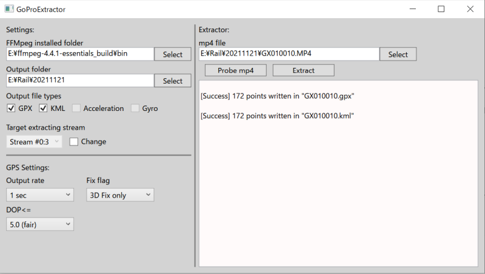

# GoProExtractor
GoProで撮影した動画（mp4）からGPSデータを抽出し，GPXおよびKML形式のファイルを出力するwindows GUIアプリ（C#，wpf）です． （HERO 10で撮影したmp4ファイルで動作確認しています）

### スクリーンショット

### 使い方など
使い方や，ビルド済み実行ファイル（exe）は以下のサイトをご覧ください．

[GoProExtractor - SkyRail@K](https://skyrail.tech/goproextractor)
